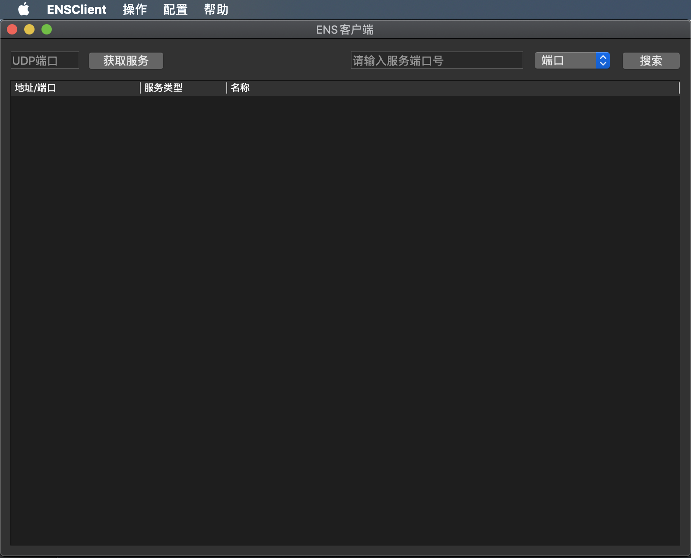
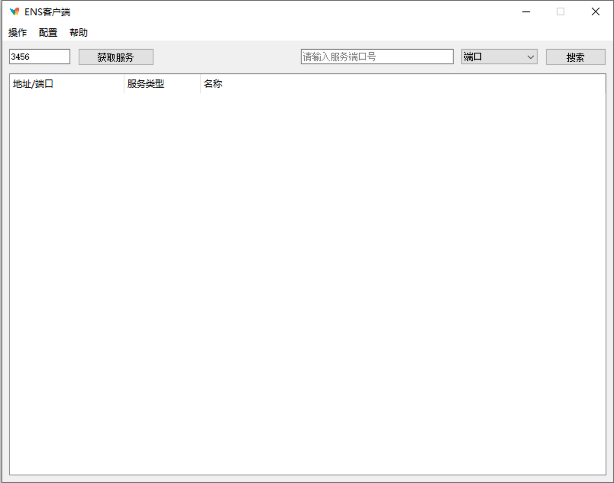
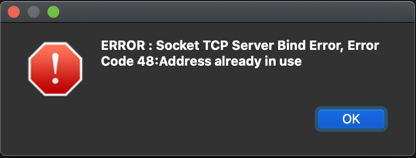

[TOC]

# EasyNetService使用帮助

## 简介

该应用主要用于局域网下，查找各个网络设备提供的网络服务，并且支持直接双击打开服务。

EasyNetService（以下简称：ENS）由客户端和服务端构成，服务端部署在提供网络服务的设备上，客户端安装在PC上。服务端提供源代码编译安装，可支持Windows、Mac、Linux系统；客户端建议使用安装包安装，目前支持Windows和Mac操作系统。

客户端界面示例如下：

## 使用

### 客户端

#### 获取服务

获取当前局域网内所有的网络服务，需要配置服务端的UDP端口。

#### 搜索服务

支持按端口、服务类型、服务名称搜索当前局域网内的服务。

#### 打开服务

使用系统默认程序打开服务，打开服务有如下三种操作方式：

1. 双击要打开的服务
2. 右键单击要打开的服务，点击打开
3. 选定要打开的服务，选择菜单栏的 操作->打开

#### 配置TCP端口

当默认使用的TCP端口被占用时，客户端会提示打开TCP端口出错，如下：

表示端口已被占用，此时点击菜单栏->配置->TCP端口修改TCP端口即可。

#### 配置应用

配置打开服务时使用的命令行，例如：windows上使用cmd打开web服务的命令是：start http://(+要访问的地址)，这里使用$(IP)替代服务器的地址，使用$(PORT)替代端口，因此命令行可配置为：start http://$(IP):$(PORT)。以此类推。

如果需要使用终端，例如打开ssh服务，则需要勾选“使用终端”即可。

默认配置中包含ssh、samba、web等服务的命令配置，根据需要增删。

#### 配置终端

当命令需要使用终端时，需要用命令启动终端，这里配置启动新终端的命令，例如windows下可使用 start cmd /k +命令行  打开新终端并在新终端中执行命令行，其中，命令行使用$(cmd)代替，因此配置为：start cmd /k $(cmd)。Mac下需要使用简单的bash脚本启动命令行。

该项如果没有特殊需求，请勿修改！

### 服务端

详情请见[https://github.com/huangweikai465/ENSServer](https://github.com/huangweikai465/ENSServer)。

## 适用场景

适用场景如下：

+ 树莓派等嵌入式linux设备调试开发、服务器等无屏的场景
+ 局域网内多个服务器的场景
+ 企业中需要经常访问服务器的场景

## 解决的问题

该软件主要解决以下四个痛点：

+ 在动态IP下，经常找不到设备IP，需要经过负责的手段才能查询到设备地址的情况，使用该软件可自动获取到设备IP
+ 用户忘记设备IP时，使用该软件可自动获取设备IP
+ 设备迁移到新的网络环境下时，仍然可以自动获取到设备IP。
+ 在频繁访问设备时，需要多次使用相同的命令访问设备的场景，可以在软件中预存设备操作命令，双击即可访问设备，例如需要频繁打开服务器上的某个页面；或者需要频繁的ssh登陆设备时，可以节约这部分操作的时间，从而提高工作效率

## 多服务端对多客户端

在应用场景下，经常会有多个服务端的场景，而且公司员工也不止一个人，即存在多对多的场景需求。在这种应用场景下只需要保证服务端使用的端口均为同一个即可，例如所有服务均使用3456端口作为UDP端口，即可。

## Q&A

1. 服务端部署好了，但是客户端上获取不到服务
   答： 需要检查：1. 服务端上的服务是否正常运行，2. 服务端使用的端口与客户端上的“UDP端口”是否一致，3. 客户端所在的网络能否和服务端互相访问到。
2. 当前软件的局限性
   答：目前应用场景只能局限于单一局域网下，如果有多层局域网则只能获取到与客户端处于同一层网络的设备；其次目前网络传输为做加密，后续会更新加密传输选项
3. 后续更新计划
   答：后续软件更新主要解决软件的局限性问题，后续更新时间未定，本人有时间就继续更新。目前只是完成了初版的内容。

